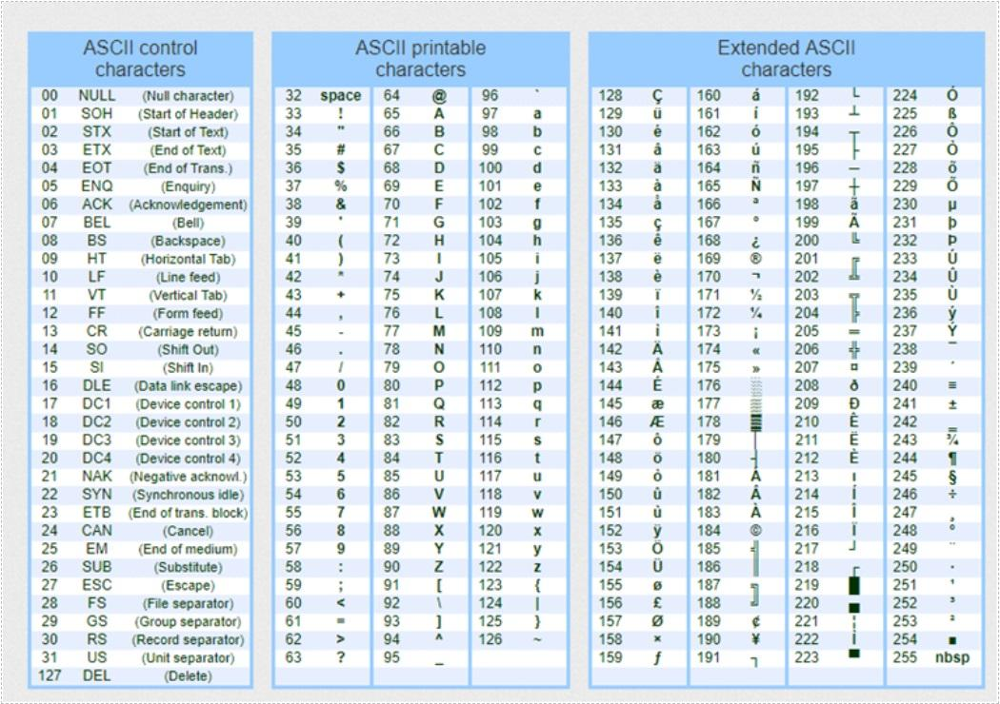

# ps0004 - ASCII Printable Characters

## Required
- To print the equivalent character for a valid number user inputted form 32:126 _(ASCII Printable Characters)_.



- otherwise print invalid and exit the program
- Here are some test cases:
```
Enter a number from 32 to 126: 0
Invalid character/s or zero value!
```
```
Enter a number from 32 to 126: +
Invalid character/s or zero value!
```
```
Enter a number from 32 to 126: u
Invalid character/s or zero value!
```
```
Enter a number from 32 to 126: my
Invalid character/s or zero value!
```
```
Enter a number from 32 to 126: 66.9
Invalid: a floating point number!
```
```
Enter a number from 32 to 126: -7.5
Invalid: a floating point number!
```
```
Enter a number from 32 to 126: 7
Invalid: number is out of the range!
```
```
Enter a number from 32 to 126: -5
Invalid: number is out of the range!
```
```
Enter a number from 32 to 126: 127
Invalid: number is out of the range!
```
```
Enter a number from 32 to 126: 77
The character for 77 is M.
```
```
Enter a number from 32 to 126: 33
The character for 33 is !.
```
```
Enter a number from 32 to 126: 120
The character for 120 is x.
```

## Links
[Document link](https://drive.google.com/file/d/1NGCzYbnRp07nqhpZLlPgZKUSuWFsVSwK/view?usp=drive_link) for problem story (you can have fun while solving problems 😂)
